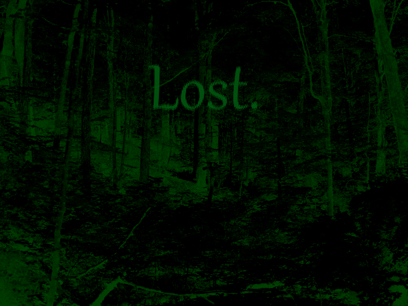

<html lang="en">
  <head>
    <meta charset="utf-8" />
    <meta name="robots" content="noindex, nofollow" />
    <meta name="viewport" content="width=device-width, initial-scale=1" />
    <link rel="stylesheet" type="text/css" href="../common/style.css" />
  </head>
  
  <body>
    

      
      <map name="error">
      </map>
    

    

      
You've lost your way. Try something else.

    

  </body>
</html>
